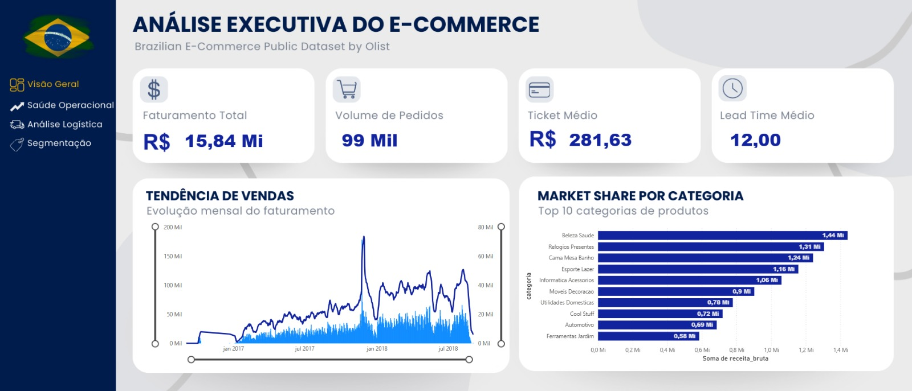
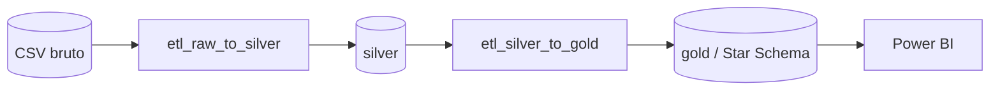

---
hide:
  - navigation
---

# Brazilian E-Commerce ETL

Pipeline de **ETL com Arquitetura de Medalhão** sobre o dataset público da **Olist**, com
modelagem dimensional em PostgreSQL e dashboard analítico em Power BI.

Disciplina de **Sistemas de Banco de Dados 2** · Engenharia de Software, FGA/UnB.

{ .shot }

## O dataset

[Brazilian E-Commerce Public Dataset by Olist](https://www.kaggle.com/datasets/olistbr/brazilian-ecommerce)
— cerca de **100 mil pedidos** realizados entre **2016 e 2018** em marketplaces brasileiros.

Deste conjunto, o pipeline consome três arquivos: pedidos, itens de pedido e produtos.

## O caminho dos dados

**Raw** — os CSVs originais da Olist, sem tratamento, como vieram da fonte.

**Silver** — dados limpos, tipados e enriquecidos, consolidados em uma tabela ampla com
métricas derivadas como segmento de preço e prazo de entrega.

**Gold** — modelo dimensional em *Star Schema*, com quatro dimensões e uma tabela fato, pronto
para consumo analítico.

[Entender a arquitetura](pipeline/arquitetura.md){ .md-button .md-button--primary }

## O que o projeto entrega

- :material-database-cog: **Pipeline reproduzível**

    Banco em contêiner Docker e dois notebooks que levam do CSV ao modelo dimensional.

- :material-star-four-points: **Modelagem dimensional**

    *Star Schema* com nomenclatura padronizada por mnemônicos documentados.

- :material-chart-box: **Dashboard analítico**

    Quatro painéis em Power BI: visão geral, saúde operacional, logística e segmentação.

- :material-file-document-multiple: **Documentação de modelo**

    MER/DER das camadas silver e gold, dicionário de dados e consultas analíticas de validação.

## Stack

| Camada | Tecnologia |
|---|---|
| Banco de dados | PostgreSQL 15 (Alpine) em Docker |
| Transformação | Python 3.10 · pandas · SQLAlchemy · psycopg2 |
| Exploração | Jupyter Notebook · seaborn · matplotlib |
| Visualização | Power BI |

[Ver no GitHub](https://github.com/GenilsonJrs/brazilian-ecommerce-etl){ .md-button }
[Como rodar](como-rodar.md){ .md-button }
