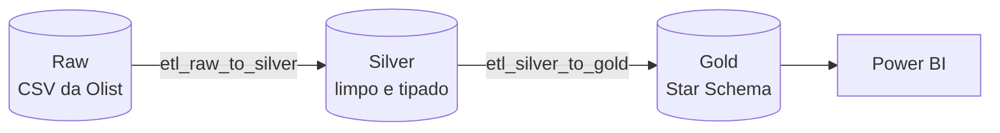

# Arquitetura de medalhão

A **Arquitetura de Medalhão** organiza o pipeline em camadas sucessivas, cada uma com um contrato
de qualidade mais forte que a anterior. O dado nunca volta atrás: cada etapa lê da camada anterior
e escreve na seguinte.

## As camadas neste projeto

| Camada | Onde vive | Contrato |
|---|---|---|
| **Raw** | `Data Layer/raw/` — arquivos CSV | Dado como veio da fonte, sem tratamento |
| **Silver** | Schema `silver` no PostgreSQL | Tipado, sem duplicatas, com colunas derivadas |
| **Gold** | Schema `DW` no PostgreSQL | Modelo dimensional, otimizado para consulta analítica |

!!! note "Duas camadas de banco, não três"
    A arquitetura clássica costuma citar **Bronze, Silver e Gold**. Aqui o papel do bronze — a
    cópia fiel do dado bruto — é cumprido pelos **próprios CSVs versionados** em `Data Layer/raw/`,
    e o pipeline vai direto de raw para silver.

    São, portanto, **dois notebooks** de transformação, não três.

## Por que separar assim

**Raw preserva a origem.** Manter o CSV intocado permite reprocessar tudo quando uma regra de
limpeza mudar, sem depender de baixar o dataset de novo.

**Silver resolve qualidade de uma vez.** Tipagem, duplicatas e valores derivados são tratados em
um único lugar. Quem consome silver não precisa repetir essa limpeza.

**Gold resolve forma.** O *Star Schema* não adiciona qualidade — adiciona **conveniência de
consulta**. Uma tabela fato cercada de dimensões responde perguntas analíticas com junções
simples e previsíveis, que é exatamente o que uma ferramenta de BI espera encontrar.

## Os dois notebooks

Ambos em `Transformer/`, executados nesta ordem:

| Ordem | Notebook | O que faz |
|:---:|---|---|
| 1 | [`etl_raw_to_silver.ipynb`](https://github.com/GenilsonJrs/brazilian-ecommerce-etl/blob/main/Transformer/etl_raw_to_silver.ipynb) | Lê os CSVs, limpa, tipa, deriva colunas e carrega no schema `silver` |
| 2 | [`etl_silver_to_gold.ipynb`](https://github.com/GenilsonJrs/brazilian-ecommerce-etl/blob/main/Transformer/etl_silver_to_gold.ipynb) | Lê `silver`, monta dimensões e a tabela fato no schema `DW` |

A ordem não é negociável: o segundo notebook lê o que o primeiro escreveu.

## Documentação de modelo

Cada camada de banco tem seu próprio DDL e diagrama entidade-relacionamento versionados:

| Artefato | Camada |
|---|---|
| `Data Layer/silver/ddl.sql` | Definição das tabelas silver |
| `Data Layer/silver/mer_der_dld_silver.pdf` | MER/DER da camada silver |
| `Data Layer/gold/ddl.sql` | Definição do Star Schema |
| `Data Layer/gold/mer_der_dld_gold.pdf` | MER/DER da camada gold |
| `Data Layer/gold/mnemonico.md` | Dicionário de abreviações e padrões de nomenclatura |
| `Data Layer/gold/consultas.sql` | Consultas analíticas de validação do modelo |
| `Data Layer/raw/dicionario_de_dados.pdf` | Dicionário do dataset original |
