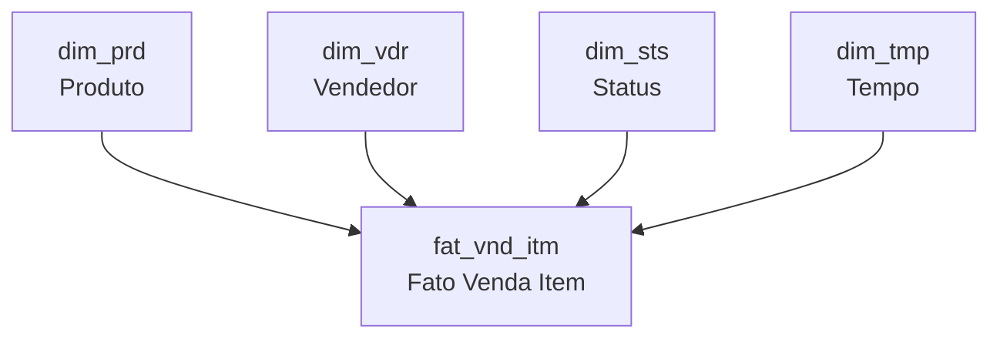

# Camada gold

O modelo dimensional. Lê a camada silver e monta um **Star Schema** no schema `DW`, pronto para
consumo analítico.

**Notebook:** `Transformer/etl_silver_to_gold.ipynb`

## O Star Schema

Uma tabela fato ao centro, cercada por quatro dimensões. Toda pergunta analítica vira uma junção
direta da fato com as dimensões que interessam — sem cadeias de junções aninhadas.

## Tabelas

| Tabela | Papel | Descreve |
|---|---|---|
| `DW.fat_vnd_itm` | **Fato** | Métricas de venda e frete, no grão do item de pedido |
| `DW.dim_prd` | Dimensão | Produto e categoria |
| `DW.dim_vdr` | Dimensão | Vendedor |
| `DW.dim_sts` | Dimensão | Status do pedido |
| `DW.dim_tmp` | Dimensão | Tempo, para análise de tendência e sazonalidade |

## A nomenclatura por mnemônicos

O modelo adota abreviações padronizadas, documentadas em
[`Data Layer/gold/mnemonico.md`](https://github.com/GenilsonJrs/brazilian-ecommerce-etl/blob/main/Data%20Layer/gold/mnemonico.md).

**Prefixos:**

| Prefixo | Significado |
|---|---|
| `dim_` | Tabela dimensional |
| `fat_` | Tabela fato |
| `vw_` | Visão analítica |

**Abreviações:**

| Abreviação | Significado |
|---|---|
| `prd` | Produto |
| `vdr` | Vendedor |
| `sts` | Status |
| `tmp` | Tempo |
| `vnd` | Venda |
| `itm` | Item |

!!! note "Por que abreviar"
    Nomenclatura curta e padronizada é convenção comum em modelagem dimensional: encurta consultas
    e torna o tipo da tabela legível pelo próprio nome.

    O custo é a curva de entrada — e é por isso que o dicionário de mnemônicos existe e é
    versionado junto do modelo. Abreviação sem dicionário vira adivinhação.

## Consultas de validação

[`Data Layer/gold/consultas.sql`](https://github.com/GenilsonJrs/brazilian-ecommerce-etl/blob/main/Data%20Layer/gold/consultas.sql)
reúne consultas que **validam o Star Schema e extraem os primeiros achados**:

- **Curva de vendas** — receita total por mês e ano
- **Efeito fim de semana** — comportamento de compra por dia da semana
- **Status de entrega** — distribuição dos pedidos por situação

!!! tip "Consulta de validação não é enfeite"
    Um Star Schema pode estar sintaticamente correto e ainda assim errado: chaves que não casam,
    grão duplicado, dimensão com linhas órfãs. Rodar consultas que produzem números conhecidos é
    o que revela isso — se a receita total não bate com a soma da silver, algo se perdeu no
    caminho.

## Artefatos

| Arquivo | Conteúdo |
|---|---|
| `Data Layer/gold/ddl.sql` | Definição do Star Schema |
| `Data Layer/gold/mer_der_dld_gold.pdf` | Diagrama entidade-relacionamento |
| `Data Layer/gold/mnemonico.md` | Dicionário de mnemônicos |
| `Data Layer/gold/consultas.sql` | Consultas analíticas |
